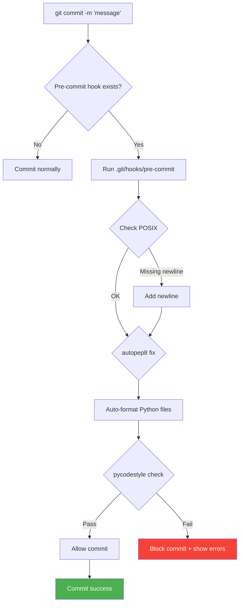

# 🔍 How It Works - Technical Architecture

Understanding the git templates and code quality automation system.

---

## 🏗️ Architecture Overview

```
┌─────────────────────────────────────────────────────────────┐
│                    Global Git Config                         │
│  ~/.gitconfig: init.templateDir = ~/WORKSPACE/.git-templates │
└────────────────────────┬────────────────────────────────────┘
                         │
                         ▼
┌─────────────────────────────────────────────────────────────┐
│              Template Directory                              │
│          ~/WORKSPACE/.git-templates/                         │
│  ├── hooks/pre-commit  ← Master hook script                 │
│  ├── scripts/          ← Utility scripts                     │
│  └── docs/             ← Documentation                       │
└────────────────────────┬────────────────────────────────────┘
                         │
        ┌────────────────┴────────────────┐
        │                                  │
        ▼                                  ▼
  git init/clone                    apply-to-all-repos.sh
        │                                  │
        ▼                                  ▼
┌─────────────────────┐          ┌─────────────────────┐
│   New Repository    │          │  Existing Repos     │
│  .git/hooks/        │          │  .git/hooks/        │
│  └── pre-commit ✅  │          │  └── pre-commit ✅  │
└─────────────────────┘          └─────────────────────┘
```

---

## 🔄 Git Init/Clone Flow

### When You Run `git init`

```bash
$ git init my-project
```

**What Git Does:**

1. **Read Global Config**

   ```bash
   git config --global init.templateDir
   # Returns: ~/WORKSPACE/.git-templates
   ```

2. **Create .git Directory**

   ```bash
   mkdir my-project/.git
   ```

3. **Copy Template Contents**

   ```bash
   cp -r ~/WORKSPACE/.git-templates/* my-project/.git/
   ```

4. **Set Permissions**

   ```bash
   chmod +x my-project/.git/hooks/*
   ```

5. **Initialize Repo**
   ```bash
   # Create refs, HEAD, config, etc.
   ```

**Result:** `my-project/.git/hooks/pre-commit` exists and is executable ✅

### When You Run `git clone`

Same process, but happens after downloading:

```bash
$ git clone https://github.com/example/repo.git
```

Git automatically:

1. Downloads repo
2. Copies hooks from template
3. Ready to use

---

## 🎯 Pre-commit Hook Workflow

### Trigger: `git commit`



### Hook Script Breakdown

```bash
#!/usr/bin/env bash

# 1. POSIX Compliance Check
FILES=$(git diff --cached --name-only --diff-filter=ACM)
for FILE in $FILES; do
    if [ -n "$(tail -c 1 "$FILE")" ]; then
        echo >> "$FILE"  # Add newline
        git add "$FILE"  # Re-stage
    fi
done

# 2. Auto-fix Python Files
PY_FILES=$(git diff --cached --name-only | grep '\.py$')
if [ -n "$PY_FILES" ]; then
    autopep8 --in-place --aggressive --max-line-length=120 $PY_FILES
    git add $PY_FILES  # Re-stage fixed files
fi

# 3. Validate PEP 8
if [ -n "$PY_FILES" ]; then
    pycodestyle --max-line-length=120 $PY_FILES
    if [ $? -ne 0 ]; then
        echo "❌ PEP 8 violations found"
        exit 1  # Block commit
    fi
fi

echo "✅ All checks passed!"
exit 0  # Allow commit
```

---

## 🔧 autopep8 vs pycodestyle

### autopep8 (Auto-fixer)

**Purpose**: Automatically fix PEP 8 violations

**What it fixes**:

- ✅ Indentation
- ✅ Whitespace around operators
- ✅ Blank lines between functions/classes
- ✅ Import formatting
- ✅ Trailing whitespace

**Example:**

```python
# Before
from odoo import models,fields
class Test(models.Model):
    _name='test'

# After autopep8
from odoo import models, fields


class Test(models.Model):
    _name = 'test'
```

### pycodestyle (Validator)

**Purpose**: Check for remaining violations

**What it checks**:

- Line too long
- Complex violations autopep8 can't fix
- Style issues requiring manual intervention

**Example output:**

```
models/sale.py:45:80: E501 line too long (125 > 120 characters)
models/sale.py:102:1: E302 expected 2 blank lines, found 1
```

---

## 📁 File Structure Explained

```
~/WORKSPACE/.git-templates/
│
├── README.md                    # Quick start guide
│
├── hooks/                       # Git hooks (copied to repos)
│   └── pre-commit              # Main hook script
│
├── scripts/                     # Utility scripts
│   ├── apply-to-all-repos.sh   # Apply hooks to existing repos
│   └── verify-setup.sh         # Verify installation
│
└── docs/                        # Documentation
    ├── setup-guide.md          # Setup instructions
    ├── how-it-works.md         # This file
    └── troubleshooting.md      # Common issues
```

### Why This Structure?

1. **hooks/**: Git automatically copies this to `.git/hooks/`
2. **scripts/**: Helper utilities, NOT copied to repos
3. **docs/**: Documentation, NOT copied to repos
4. **README.md**: Entry point at root

---

## 🌍 Glob al vs Local

### Global Config

```bash
$ git config --global init.templateDir ~/WORKSPACE/.git-templates
```

Stored in: `~/.gitconfig`

```ini
[init]
    templateDir = /Users/username/WORKSPACE/.git-templates
```

**Scope**: All git repos on this machine

### Template Directory

Location: `~/WORKSPACE/.git-templates/`

**Not a git repo** (unless you make it one for version control)

**Contains**: Master copies of hooks, scripts, docs

### Individual Repos

Each repo gets its own **copy** of hooks:

```
my-repo/
└── .git/
    └── hooks/
        └── pre-commit  ← Copied from template
```

**Independence**: Editing `my-repo/.git/hooks/pre-commit` doesn't affect other repos

**Update**: Run `apply-to-all-repos.sh` to update all repos

---

## 🔄 Update Workflow

### Scenario: Modify Pre-commit Hook

```bash
# 1. Edit master template
vim ~/WORKSPACE/.git-templates/hooks/pre-commit

# 2. Test changes
cd ~/WORKSPACE/test-repo
.git/hooks/pre-commit  # Manual test

# 3. Apply to all repos
cd ~/WORKSPACE/.git-templates/scripts
./apply-to-all-repos.sh
```

**What happens:**

```bash
# Script does this for each repo:
cd /path/to/repo
git init  # Re-init → copies updated hooks
```

**Result**: All repos now have updated hook ✅

---

## 🎨 VS Code Integration

### Format On Save

**Setting:**

```json
{
  "editor.formatOnSave": true,
  "[python]": {
    "editor.defaultFormatter": "ms-python.python"
  },
  "python.formatting.provider": "autopep8"
}
```

**Workflow:**

1. User edits file
2. User presses Cmd/Ctrl + S
3. VS Code calls autopep8
4. File auto-formatted
5. File saved

### Organize Imports

**Setting:**

```json
{
  "editor.codeActionsOnSave": {
    "source.organizeImports": "explicit"
  }
}
```

**What it does**:

- Sort imports alphabetically
- Group by: stdlib, third-party, local
- Remove unused imports

---

## 📊 Execution Order

### Complete Commit Workflow

```
Developer writes code
         ↓
Press Cmd/Ctrl + S
         ↓
[VS Code] Format on save (autopep8)
[VS Code] Organize imports
[VS Code] Add final newline
         ↓
File saved to disk
         ↓
git add filename
         ↓
git commit -m "message"
         ↓
[Git] Run .git/hooks/pre-commit
         ↓
[Hook] Check POSIX compliance
[Hook] Run autopep8 (again, for safety)
[Hook] Run pycodestyle validation
         ↓
[Hook] Exit 0 (success) or Exit 1 (failure)
         ↓
[Git] Create commit or abort
```

**Redundancy**: autopep8 runs twice (VS Code + hook) for safety

---

## 🔒 Security & Isolation

### Template Safety

**Template directory**:

- ❌ Not modified by hooks
- ❌ Not affected by repo operations
- ✅ Read-only for git init/clone

**Individual repos**:

- ✅ Each has independent copy
- ✅ Can modify per-repo hooks
- ✅ Won't affect other repos

### Hook Execution

Hooks run with:

- User's permissions
- Repo's working directory
- No network access required
- No external dependencies (except Python tools)

---

## 🎯 Performance

### Git Init/Clone

**Overhead**: ~5-10ms to copy hooks

**One-time**: Only on repo creation

### Pre-commit Hook

**Typical run time**:

- Empty commit: ~50ms
- 1 Python file: ~200ms
- 10 Python files: ~1s

**Caching**: Git stages files, so repeated commits are fast

---

## 🔄 Disable/Enable

### Temporarily Disable

```bash
git commit --no-verify -m "skip checks"
# or
git commit -n -m "skip checks"
```

### Permanently Disable (Single Repo)

```bash
rm .git/hooks/pre-commit
```

### Permanently Disable (All New Repos)

```bash
git config --global --unset init.templateDir
```

---

## 📚 Git Hooks Reference

### Available Hooks

- `pre-commit`: Before commit message
- `prepare-commit-msg`: Edit commit message
- `commit-msg`: Validate commit message
- `post-commit`: After successful commit
- `pre-push`: Before push
- `post-merge`: After merge

### Adding More Hooks

Place in `~/WORKSPACE/.git-templates/hooks/`:

```bash
cd ~/WORKSPACE/.git-templates/hooks
echo '#!/bin/bash\necho "Post-commit hook ran!"' > post-commit
chmod +x post-commit
```

Apply to repos:

```bash
cd ../scripts
./apply-to-all-repos.sh
```

---

## 🎓 Key Takeaways

1. **Global Config**: One setting affects all repos
2. **Template**: Master copy in WORKSPACE
3. **Copies**: Each repo gets independent copy
4. **Updates**: Re-run script to update all repos
5. **Redundancy**: Multiple layers (VS Code + git hooks)
6. **Safety**: Template never modified by hooks

---

**Understanding = Power** 💪

Now you know exactly how it all works!
