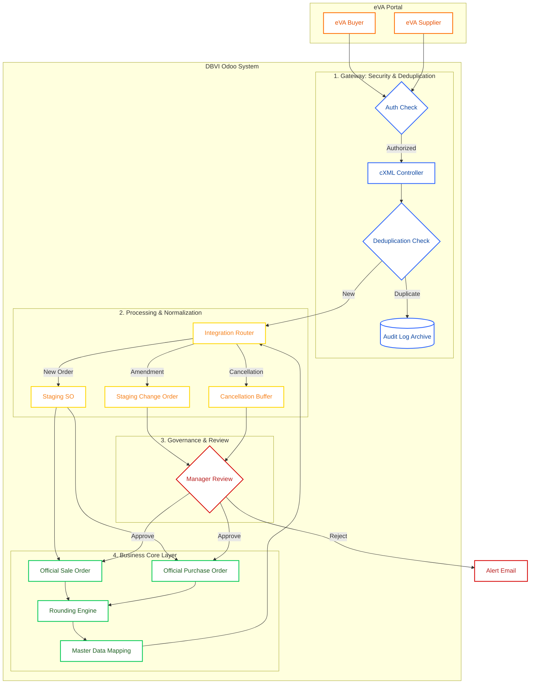

# 🏛️ Unified eVA Integration Solution (Vertical Workflow)

This diagram illustrates the complete data flow, system boundaries, and staging layers between the eVA Portal (Buyer/Supplier Hubs) and Odoo.

## 📝 Detailed System Components & Workflow

To ensure a robust, secure, and error-proof integration, the system is designed in four distinct layers:

### 🌍 1. eVA Portal Personas (The Roles)

The integration handles two primary transactional roles for Odoo:

- **🏢 eVA Buyer Flow (Orange Path - Odoo as Buyer)**: This represents Odoo in the **Purchasing** role. After a "PunchOut" session with a vendor, eVA sends a message back to our Gateway to finalize and record the **Purchase Order** in Odoo.
- **🚚 eVA Supplier Flow (Blue Path - Odoo as Supplier)**: This represents Odoo in the **Sales** role. Government Agencies send **cXML OrderRequests** directly to our Gateway. Odoo then processes these to create **Sale Orders** and **Change Orders**.

### 🛡️ Layer 1: Gateway & Audit (The Black Box)

This is the "Security Guard" of the system.

- **cXML Controller**: Validates that every incoming message is authentic using a "Shared Secret" (Digital Handshake). It also enforces **IP Whitelisting** and **TLS 1.2+** standards as agreed with the eVA Technical Group.
- **Audit Log Archive**: Every single XML file (the raw data) is saved permanently.
- **Duplicate Prevention**: The Gateway uses the `PayloadID` (or a combination of `UniqueName` + `VersionNumber`) to immediately discard redundant transmissions, preventing double-entry in accounting.

### 📦 Layer 2: Staging Layer (The Safety Buffer)

A critical design choice. We **never** write incoming raw data directly into your official Sales or Purchase records.

- **Why a Buffer?**: Incoming data can be "messy" (e.g., a product code that doesn't exist yet in Odoo). The Staging Layer holds this data in a temporary area.
- **Data Enrichment & Normalization**:
    - **UoM Normalization**: Translates eVA's numeric unit IDs (e.g., '47') into Odoo standard units ('50 lb Bag').
    - **Tax & Shipping Extraction**: Specifically "quenches" the total cost by extracting tax and freight from either header fields or dedicated line items, ensuring the **TotalCost** matches Odoo's calculation to the cent.
    - **Financial Rounding**: Appiles the portal's specific 5-decimal rounding rules to prevent 1-cent discrepancies during reconciliation.
- **Preparer/Requester Capture**: For Sale Orders, we capture the Agency's **Preparer & Requester email/phone** (from header fields).
- **STG_CO (Change Orders)**: Handles complex `transaction_type` logic:
    - `SEND`: New record creation.
    - `PCNCL/CCNCL`: Partial or cumulative cancellations requiring granular line updates (`add/change/delete`).
    - `CNCL`: Full order cancellation triggers a hold on logistics and production.

### 👥 Layer 3: Governance & Review (The Safety Switch)

- **Manual Oversight**: While new orders can be automated, **Change Orders** and **Cancellations** trigger a **Manager Review** notification.
- **Human in the Loop**: A manager must verify the impacts of a cancellation (e.g., if the goods are already shipped) before the official record is updated.

### ⚙️ Layer 4: Business Core (The Final Records)

The finish line where data becomes official:

- **Sale Order**: Updated only after Staging validation and Manager Review.
- **Purchase Order**: Supports **Split Accounting** (Fund, Funct, Object codes) and **Cardinal Account** mappings.
- **🧠 Master Data**: The "Brain" linking everything:
    - **Identity Mapping**: Agency/FIPS codes to Odoo Partners.
    - **Product Mapping**: SupplierPartID & NIGP Codes to Odoo Products.
    - **Rounding Engine**: Centralized utility to ensure financial calculations stay consistent with the eVA/Cardinal accounting standards.
