# 🏛️ Unified eVA Integration Solution (Vertical Workflow)

This diagram illustrates the complete data flow, system boundaries, and staging layers between the eVA Portal (Buyer/Supplier Hubs) and Odoo.

```mermaid
flowchart TD
    %% Define High-Contrast Styles (Bold Dark Text)
    classDef portal fill:#FFF,stroke:#FF6D00,stroke-width:3px,color:#E65100,font-weight:bold;
    classDef gateway fill:#FFF,stroke:#2962FF,stroke-width:3px,color:#0D47A1,font-weight:bold;
    classDef staging fill:#FFF,stroke:#FFD600,stroke-width:4px,color:#F57F17,font-weight:bold;
    classDef core fill:#FFF,stroke:#00C853,stroke-width:3px,color:#1B5E20,font-weight:bold;
    classDef manual fill:#FFF,stroke:#D50000,stroke-width:3px,color:#B71C1C,font-weight:bold;

    %% Subgraph Styles (Darker Labels)
    style EVA_PORTAL fill:#FFFFFF,stroke:#333,stroke-width:1px,stroke-dasharray: 5 5,color:#212121;
    style ODOO_SYSTEM fill:#FFFFFF,stroke:#333,stroke-width:2px,color:#212121;
    style LAYER_GATEWAY fill:#F8F9FA,stroke:#CCC,stroke-width:1px,color:#424242;
    style LAYER_STAGING fill:#FFFDE7,stroke:#FFD600,stroke-width:1px,color:#424242;
    style LAYER_REVIEW fill:#FFF,color:#424242;
    style LAYER_CORE fill:#F1F8E9,stroke:#CCC,stroke-width:1px,color:#424242;

    %% --- External Layer: eVA Portal ---
    subgraph EVA_PORTAL ["eVA Portal"]
        direction LR
        EVA_BUYER(["🏢 eVA Buyer"]):::portal
        EVA_SUPPLIER(["🚚 eVA Supplier"]):::portal
    end

    %% --- Internal Layer: Odoo System ---
    subgraph ODOO_SYSTEM ["DBVI Odoo"]

        subgraph LAYER_GATEWAY ["1. Gateway & Audit Layer"]
            CTRL{"cXML Gateway\nController"}:::gateway
            LOG[("📜 Audit Log Archive")]:::gateway
        end

        subgraph LAYER_STAGING ["2. Staging Layer (Data Buffer)"]
            PROC["Integration Router"]:::staging
            STG_SO[["📦 Staging Sale Order"]]:::staging
            STG_CO[["📝 Staging Change Order"]]:::staging
            STG_PO[["🚜 Staging Purchase Order"]]:::staging
        end

        subgraph LAYER_REVIEW ["3. Governance & Review"]
            REVIEW{"Manager Review\n& Approval"}:::manual
        end

        subgraph LAYER_CORE ["4. Business Core Layer"]
            SO["📄 Sale Order"]:::core
            PO["🛒 Purchase Order"]:::core
            MD[("🧠 Master Data")]:::core
        end
    end

    %% --- Workflow Connections ---

    %% Path A: Buyer Flow (Orange)
    EVA_BUYER == "cXML PunchOut / Response" ==> CTRL

    %% Path B: Supplier Flow (Blue)
    EVA_SUPPLIER == "cXML OrderRequest" ==> CTRL

    CTRL -- "Record Log" --> LOG
    CTRL ==> PROC

    %% Routing logic to Staging
    PROC == "To PO" ==> STG_PO
    PROC == "To SO" ==> STG_SO
    PROC == "To Change" ==> STG_CO

    %% Final Processing
    STG_SO ==> SO
    STG_PO ==> PO

    STG_SO -.-> MD
    STG_PO -.-> MD

    STG_CO ==> REVIEW
    REVIEW == "Approve & Apply" ==> SO
    REVIEW == "Reject" ==> REJECT{{ 📧 Rejection Email }}:::manual

    %% Audit Links
    SO -.-> LOG
    PO -.-> LOG

    %% Global Line Styling (Enhanced Contrast)
    linkStyle default stroke:#444,stroke-width:2px;

    %% Buyer Paths (Deep Orange: #E65100)
    linkStyle 0,4,8,10,15 stroke:#E65100,stroke-width:4px;

    %% Supplier Paths (Deep Blue: #0D47A1)
    linkStyle 1,5,6,7,9,11,12,14 stroke:#0D47A1,stroke-width:4px;

    %% Shared/Audit Paths (Grey)
    linkStyle 2,3,13 stroke:#424242,stroke-width:2px;
```

## 📝 Key Components Explained

### 🌍 eVA Portal Persona

- **Buyer Hub**: Used by Commonwealth of Virginia agencies to place orders.
- **Supplier Hub**: Used for catalog confirmations or vendor-driven data.

### 🛡️ Layer 1: Audit Trail

Every transaction is logged before being processed. This ensures we have a non-repudiation record for any disputes or troubleshooting.

### 📦 Layer 2: Staging Layer (The Buffer)

Instead of direct writing to Odoo Core, processing flows through staging:

- **`STG_SO` (Staging Sale Order)**: Raw incoming SO data to prevent production corruption.
- **`STG_CO` (Staging Change Order)**: Dedicated version history for modifications.
- **`STG_PO` (Staging Purchase Order)**: Capture PunchOut messages before PO creation.

### ⚙️ Layer 3: Business Integration

- **Sale Order**: Final revenue record for suppliers, updated by Change Orders.
- **Purchase Order**: Standard Odoo workflow for procurement, created via Buyer PunchOut.
- **Change Order Logic**: Strictly for **Sales** versioning. Purchase modifications follow standard procurement revision flows.
- **Master Data**: Centralized mapping for `eva_identity_id` and `eva_uom_code`.
